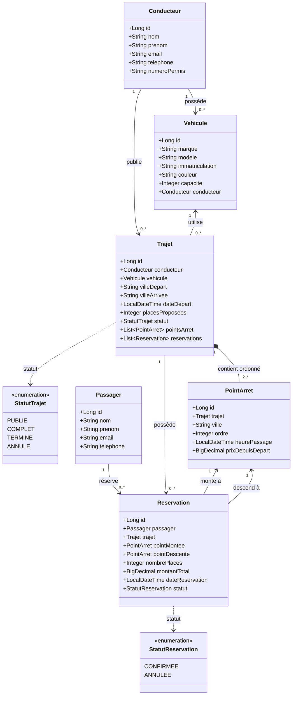

```mermaid
classDiagram
    direction TB

    class StatutTrajet {
        <<enumeration>>
        PUBLIE
        COMPLET
        TERMINE
        ANNULE
    }

    class StatutReservation {
        <<enumeration>>
        CONFIRMEE
        ANNULEE
    }

    class Conducteur {
        +Long id
        +String nom
        +String prenom
        +String email
        +String telephone
        +String numeroPermis
    }

    class Passager {
        +Long id
        +String nom
        +String prenom
        +String email
        +String telephone
    }

    class Vehicule {
        +Long id
        +String marque
        +String modele
        +String immatriculation
        +String couleur
        +Integer capacite
        +Conducteur conducteur
    }

    class Trajet {
        +Long id
        +Conducteur conducteur
        +Vehicule vehicule
        +String villeDepart
        +String villeArrivee
        +LocalDateTime dateDepart
        +Integer placesProposees
        +StatutTrajet statut
        +List~PointArret~ pointsArret
        +List~Reservation~ reservations
    }

    class PointArret {
        +Long id
        +Trajet trajet
        +String ville
        +Integer ordre
        +LocalDateTime heurePassage
        +BigDecimal prixDepuisDepart
    }

    class Reservation {
        +Long id
        +Passager passager
        +Trajet trajet
        +PointArret pointMontee
        +PointArret pointDescente
        +Integer nombrePlaces
        +BigDecimal montantTotal
        +LocalDateTime dateReservation
        +StatutReservation statut
    }

    Conducteur "1" --> "0..*" Vehicule : possède
    Conducteur "1" --> "0..*" Trajet : publie
    Vehicule "1" <-- "0..*" Trajet : utilise
    Trajet "1" *-- "2..*" PointArret : contient ordonné
    Passager "1" --> "0..*" Reservation : réserve
    Trajet "1" --> "0..*" Reservation : possède
    PointArret "1" <-- Reservation : monte à
    PointArret "1" <-- Reservation : descend à
    Trajet ..> StatutTrajet : statut
    Reservation ..> StatutReservation : statut
```
